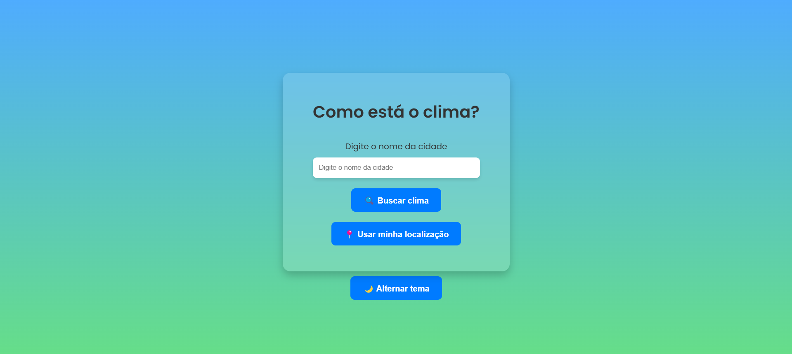
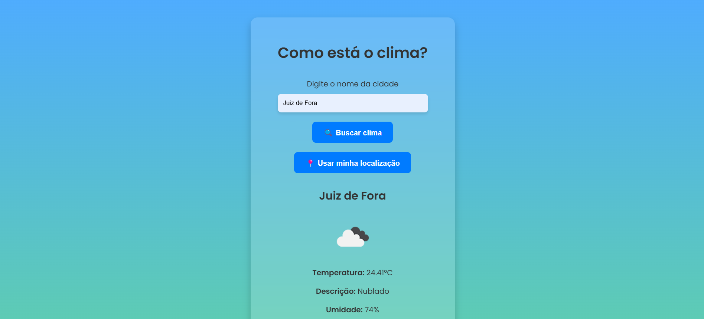
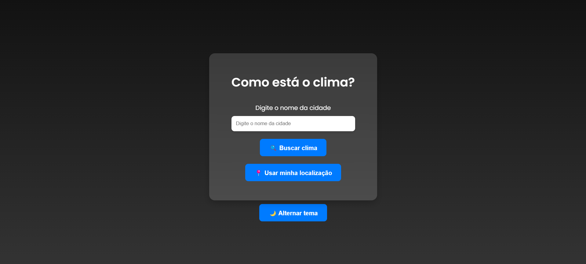

Projeto Clima 🌤️

O projeto exibe informações sobre o clima de uma região específica, permitindo que os usuários consultem a previsão do tempo de maneira simples.

## Funcionalidades
- Exibir temperatura atual, umidade e condição climática.
- Permitir consulta de diferentes cidades.
- Interface responsiva para diferentes dispositivos.

## Tecnologias Utilizadas
- **HTML**: Estruturação da página.
- **CSS**: Estilização e layout responsivo.
- **JavaScript**: Consumo de API de clima e manipulação da DOM.
- **API de Clima**: Obtém os dados meteorológicos em tempo real.

## Demonstração

